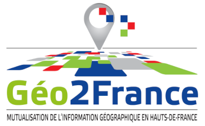

# Bonnes pratiques pour la génération de COG (Cloud Optimized GeoTIFF) avec GDAL



:gb: english version >>> <https://github.com/Doctor-Who/cog-recipes>

## Pré-requis

GDAL version >= 3.1

Documentation du driver COG <https://gdal.org/drivers/raster/cog.html>

## Raster 1 bande : MNT, MNE en format ASC par exemple

1. Construire le VRT

```bash
gdalbuildvrt my_dsm.vrt -addalpha -a_srs EPSG:2154 /dsm_directory/*.asc
```

2. Convertir en COG

```bash
gdal_translate my_dsm.vrt my_dsm_output_cog.tif -of COG -co RESAMPLING=NEAREST  -co OVERVIEW_RESAMPLING=NEAREST -co COMPRESS=DEFLATE -co PREDICTOR=2 -co NUM_THREADS=20 -co BIGTIFF=IF_NEEDED
```

RESAMPLING = méthode de rééchantillonnage qui peut être ajustée en fonction de vos usages.
Ajuster le paramètre NUM_THREAD en fonction de votre machine.

## Raster 3 bandes : Orthophoto par exemple

1. Convertir chaque tuile JP2 en TIF

Créer un répertoire **0_TIF** puis se rendre dans celui contenant les fichiers JP2 avant de lancer la commande suivante :

```bash
for f in *.jp2; do gdal_translate -of GTiff -co TILED=YES -co BIGTIFF=YES -co BLOCKXSIZE=512 -co BLOCKYSIZE=512 -co NUM_THREADS=20 -co COMPRESS=ZSTD -co PREDICTOR=2 ${f} ../0_TIF/${f%.*}.tif; done
```

**BLOCKXSIZE** et **BLOCKYSIZE** sont très importants pour les étapes suivantes. Si vous modifiez ces valeurs, faites de même à l'étape 3.

2. Construire le VRT

```bash
gdalbuildvrt my_orthophotography.vrt 0_TIF/*.tif -addalpha -hidenodata -a_srs EPSG:2154
```

Combiner les options **-addalpha -hidenodata** pour définir le nodata comme transparent (évite les bordures noires ou blanches autour de la mosaïque)

3. Convertir en COG

```bash
gdal_translate my_orthophotography.vrt my_orthophotography_output_cog.tif -of COG -co BLOCKSIZE=512 -co OVERVIEW_RESAMPLING=BILINEAR -co COMPRESS=JPEG -co QUALITY=85 -co NUM_THREADS=ALL_CPUS -co BIGTIFF=YES
```

## Bonnes pratiques

- La compression JPG offre le meilleur ratio poids/performance (compression avec perte).
- Le JP2 était déjà un format compressé (potentiellement avec perte selon le codec utilisé), définir une compression modérée entre 85~90 pour ne pas dégrader l'image.
- Si vous avez les fichiers sources brutes (TIF), vous pouvez définir une compression plus forte 75-80 dans le paramètre QUALITY.
- Le paramètre RESAMPLING (rééchantillonnage) dépend de vos choix ou de vos utilisateurs. Selon notre expérience BILINEAR offre le meilleur rendu visuel.

:warning: Si vous réalisez des traitements d'images (classification, segmentation, calcul de visibilité, etc.) optez plutôt pour NEAREST afin d'éviter l'altération des valeurs de pixels lors du rééchantillonnage. (:pray: Merci à @vincentsarago pour le conseil)

## Images de 4 bandes ou plus / images 16 bits

La compression JPG se limite à 3 bandes (RVB), utilisez DEFLATE (la plus sûre et la plus compatible) ou ZSTD (plus efficace mais qui peut poser des problèmes de compatibilité avec d'autres briques SIG en fonction des méthodes de compilation de GDAL).

## Problèmes connus

- Utiliser **gdalbuildvrt** puis **gdal_translate** est plus rapide que d'utiliser **gdalwarp**

- Sans codecs JP2 propriétaires (ERDAS, KAKADU), vous devez d'abord décompresser chaque JP2 en TIF puis construire le VRT pour le convertir ensuite en COG.
Si vous ne le faites pas, il est possible que vous observiez des artefacts ou des pixels corrompus sur des grands sets de données avec OpenJP2 driver.

- Un fichier COG sera plus volumineux qu'un JP2 ou un ECW mais plus rapide en lecture et plus interopérable sans composants propriétaires coté client ou serveur.

- Il existe des méthodes de compression plus efficaces que DEFLATE comme ZSTD or JPEG-XL mais toutes les applications SIG (desktop ou serveur) ne seront pas capable de les lire.
